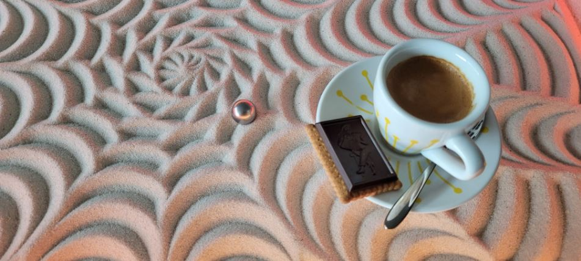

Maker Media GmbH

***

# Der IKEA-Hack Sandmaltisch

**Nach dem Erfahrungsbericht über den Bau des Sandtisches wollten viele Leser mehr wissen und der Ruf nach einer kompletten Bauanleitung wurde laut. Hier ist sie! Unser Autor hat keine Mühen gescheut und neben diesem Übersichtsartikel eine ausführliche Online-Schritt-für-Schritt-Anleitung, Stücklisten und CAD-Zeichnungen angefertigt.**

 

Den vollständigen Artikel gibt es in der [Make 4/24 ab Seite 16](https://www.heise.de/ratgeber/Ikea-Sandmaltisch-Bauanleitung-Teil-1-Material-und-Zusammenbau-9773244.html).

Hier finden Sie die Schrit-für-Schritt Anleitung, die 3D-Druckteile, die Firmware und GCODE-Beispielbilder.

